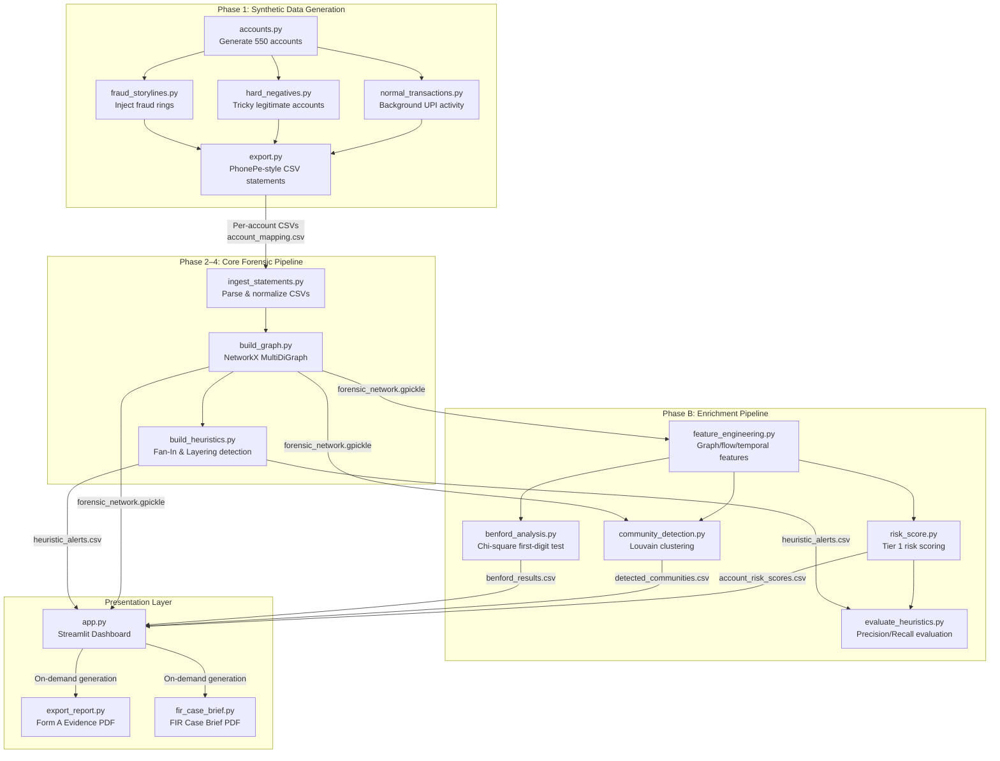

# Architecture

## System Architecture

The UPI Fraud Trail Investigator uses a **sequential pipeline architecture** — raw bank statements flow through discrete processing phases, each producing intermediate artifacts consumed by the next. The final output is an interactive investigator dashboard with PDF export capabilities.



## Components

| Component | Technology | Responsibility |
|---|---|---|
| **Data Generator** | Python, Faker, NumPy | Produces calibrated synthetic UPI transaction data with realistic fraud patterns (fan-in, layering rings) and hard-negative accounts |
| **Ingestion Engine** | Pandas | Parses PhonePe-style CSV bank statements, resolves entity names to account IDs, quarantines ambiguous entities |
| **Forensic Graph** | NetworkX (MultiDiGraph) | Models accounts as nodes and transactions as directed edges keyed by UTR — preserves parallel transactions between same accounts |
| **Heuristic Detector** | NetworkX, Pandas | Fan-In detection (Tier 1, 100% precision) and Layering chain detection (Tier 2, low-confidence secondary leads) |
| **Feature Engineering** | NetworkX, NumPy, Pandas | Computes graph-structural (degree, centrality), money-flow (volume ratios), and temporal (burst, nocturnal) features per account |
| **Risk Scorer** | Pandas, NumPy | Transparent formula: `0.5 × inv_norm(out_degree) + 0.5 × inv_norm(unique_receivers)` — not a trained ML model |
| **Community Detection** | python-louvain, NetworkX | Unsupervised Louvain clustering to discover fraud rings from pure graph structure — no labels used |
| **Benford's Analysis** | SciPy | Chi-square goodness-of-fit test against Benford's Law distribution — supplementary/exploratory signal only |
| **Investigator Dashboard** | Streamlit, Pyvis | 5-tab interactive dashboard: Overview, Alert Investigation (ego graphs), Fraud Rings, Risk Scores, Benford's Law |
| **PDF Reports** | ReportLab, Matplotlib | Court-compliant Form 'A' evidence index and FIR-ready case briefs with investigative SOP flowcharts |

## Data Flow

```
                    ┌──────────────────────────┐
                    │  Phase 1: Data Generator  │
                    │  generate_dataset.py      │
                    └───────────┬──────────────┘
                                │
                    Per-account PhonePe CSVs
                    + account_mapping.csv
                    + ground_truth.csv
                                │
                    ┌───────────▼──────────────┐
                    │  Phase 2: Ingestion       │
                    │  ingest_statements.py     │
                    └───────────┬──────────────┘
                                │
                    normalized_transactions_v3.csv
                    (unified sender→receiver ledger)
                                │
                    ┌───────────▼──────────────┐
                    │  Phase 3: Graph Builder   │
                    │  build_graph.py           │
                    └───────────┬──────────────┘
                                │
                    forensic_network.gpickle
                    (NetworkX MultiDiGraph)
                                │
              ┌─────────────────┼─────────────────┐
              │                 │                  │
    ┌─────────▼──────┐  ┌──────▼───────┐  ┌──────▼────────────┐
    │ Phase 4:       │  │ Phase B:     │  │ Phase B:          │
    │ Heuristics     │  │ Features +   │  │ Community         │
    │ (Fan-In,       │  │ Risk Score   │  │ Detection         │
    │  Layering)     │  │              │  │ (Louvain)         │
    └────────┬───────┘  └──────┬───────┘  └──────┬────────────┘
             │                 │                  │
             └────────┬────────┴──────────────────┘
                      │
              ┌───────▼────────┐
              │ Streamlit      │
              │ Dashboard      │──── PDF Export (on-demand)
              │ (app.py)       │     ├── Form 'A' Evidence Index
              └────────────────┘     └── FIR Case Brief + SOP
```

1. **Synthetic data generation** — `generate_dataset.py` creates ~550 accounts (480 normal, 20 hard-negative, 50 mule) and generates ~30,000+ UPI transactions across 60 simulated days. Fraud rings use realistic Indian UPI patterns (fan-in mule consolidation, multi-hop layering chains). Output: per-account PhonePe-style CSV statement files.

2. **Statement ingestion** — `ingest_statements.py` parses each CSV, extracts sender/receiver from narration text (e.g., "Received from Rajesh Kumar"), resolves names to canonical account IDs via `account_mapping.csv`, and quarantines ambiguous entities (duplicate names mapped to multiple IDs). Output: a single normalized transaction ledger.

3. **Graph construction** — `build_graph.py` builds a NetworkX `MultiDiGraph` where each node is an account and each directed edge is a transaction, keyed by its unique UTR reference. This preserves parallel transactions between the same pair of accounts — critical for accurate fan-in counting.

4. **Heuristic detection** — `build_heuristics.py` scans every resolved node for two patterns:
   - **Fan-In** (Tier 1): ≥5 incoming transactions consolidated into ≤2 outgoing transactions with ~85–105% amount pass-through. **100% precision, 54% recall.**
   - **Layering** (Tier 2): 2-hop chains where similar amounts are forwarded within a 200-minute window. ~30% false-positive rate — shipped as low-confidence investigative leads only.

5. **Enrichment pipeline** — `run_enrichment_pipeline.py` orchestrates five sub-phases: feature engineering (15+ graph/flow/temporal features), risk scoring (transparent 2-feature formula validated through camouflage stress-testing), Louvain community detection (7/7 multi-account rings perfectly isolated), Benford's Law analysis (supplementary), and enhanced evaluation metrics.

6. **Dashboard & export** — `app.py` serves a Streamlit dashboard with interactive ego-graph visualizations (Pyvis), filterable alert lists, community maps, and risk score tables. Investigators can generate court-compliant PDFs on demand: Form 'A' evidence indices (Section 63 BSA / Section 94 BNSS) and FIR case briefs with legal section mapping (BNS, IT Act 2000, PMLA) and graphical SOP flowcharts.

## Security Considerations

- **No API keys required** — The core pipeline runs entirely offline with synthetic data. No external service calls.
- **Secrets management** — `.env` is in `.gitignore`; `.env.example` provides a safe template.
- **Entity quarantine** — Ambiguous entities (names mapping to multiple account IDs) are tagged as `QUARANTINED` rather than silently merged, preventing false accusations from entity resolution errors.
- **Evidence precision** — PDF reports cite the *exact* UTR-keyed transactions that triggered an alert, not all transactions between two accounts. This prevents over-citation of unrelated background activity as fraud evidence.
- **No ground truth leakage** — Detection heuristics and risk scores never access `ground_truth.csv`. Ground truth is used only for evaluation scripts run separately.

## Scalability Notes

- **Graph engine** — NetworkX is suitable for the current ~550-node / ~30,000-edge scale. For production datasets (millions of accounts), migration to a distributed graph database (e.g., Neo4j, TigerGraph) or Apache Spark GraphX would be necessary.
- **Stateless pipeline** — Each phase reads its inputs from disk and writes outputs to disk. Phases can be independently re-run or parallelized.
- **Dashboard** — Streamlit is single-process. For multi-user deployment, consider wrapping the pipeline behind a FastAPI service with Streamlit as the UI layer, or deploying via Streamlit Community Cloud.
- **PDF generation** — ReportLab is synchronous and single-threaded. For high-volume report generation, a task queue (Celery + Redis) could be added.
